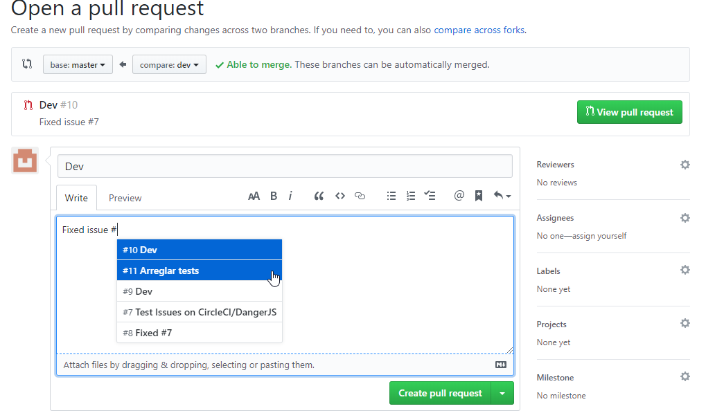
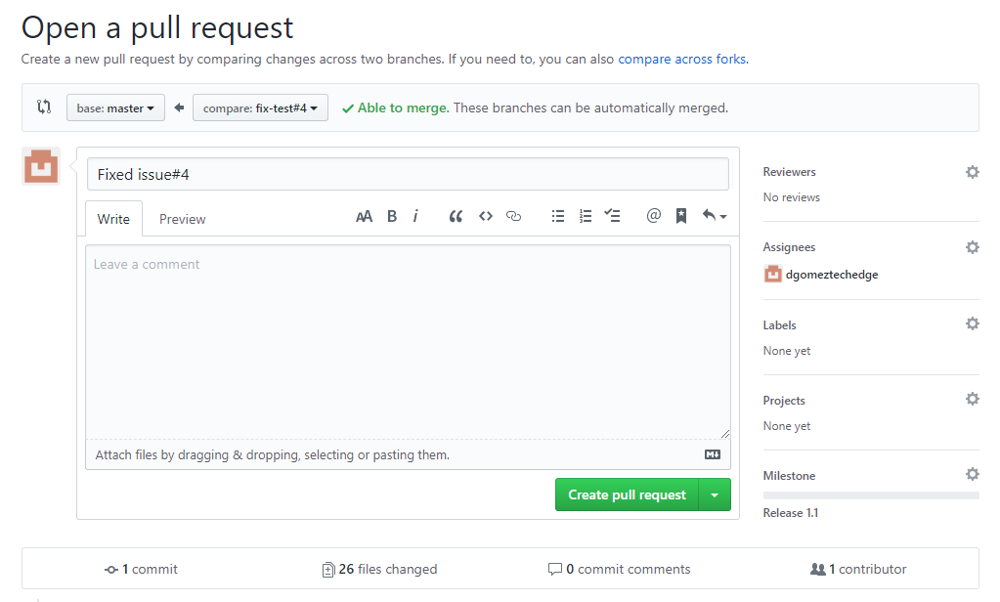
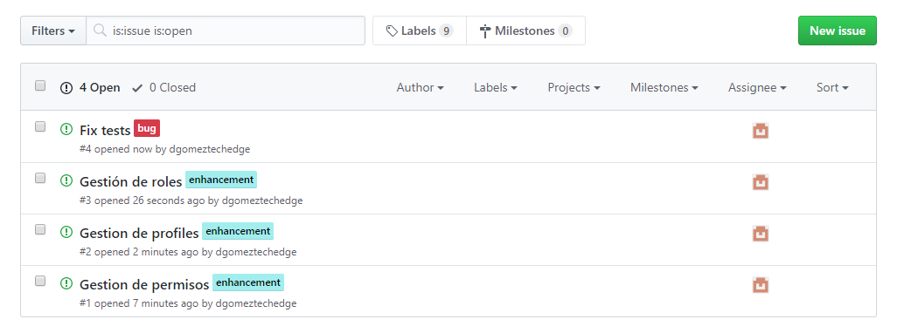
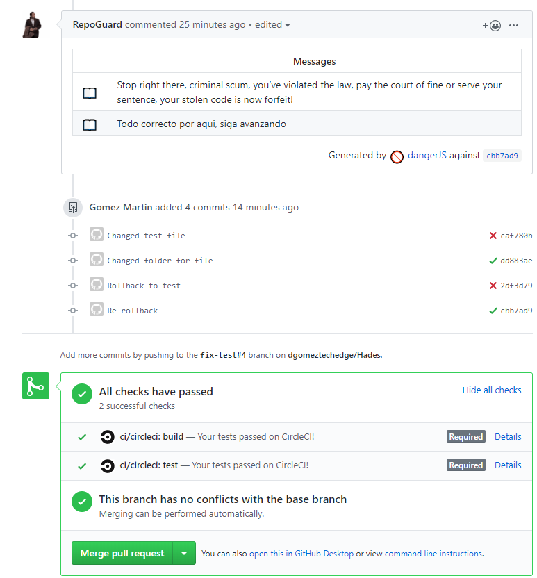
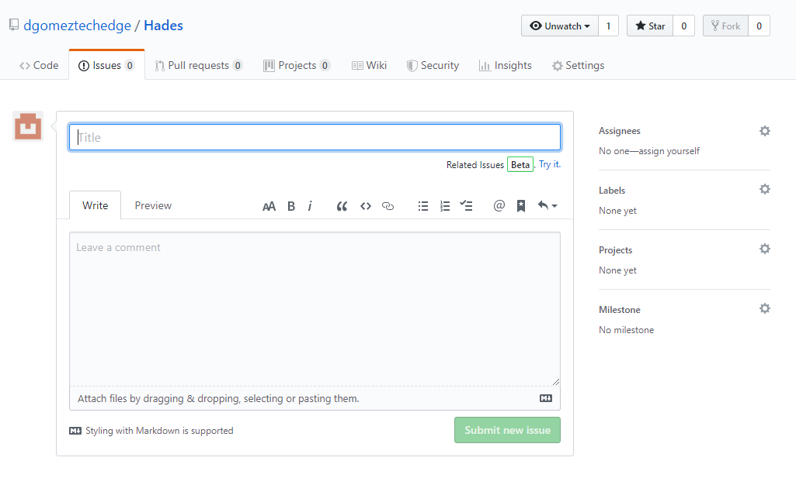
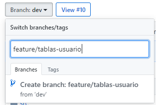
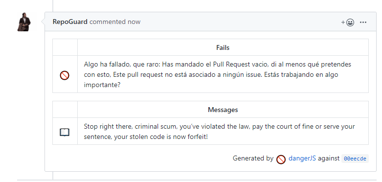
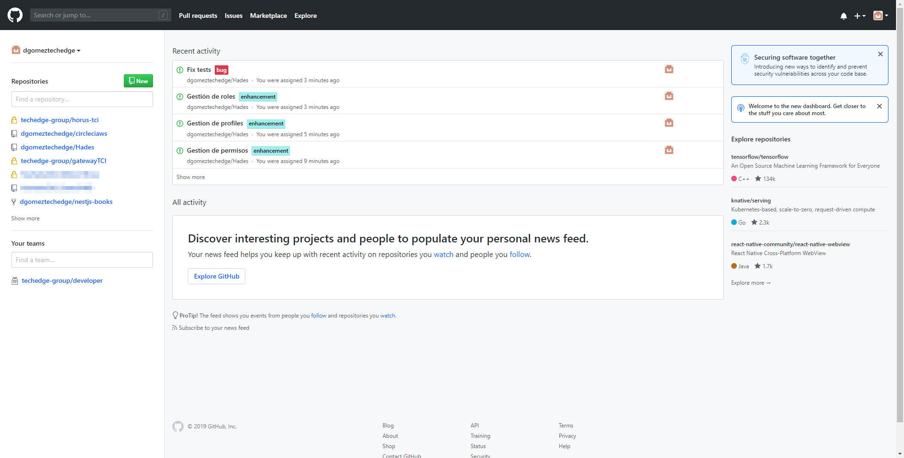
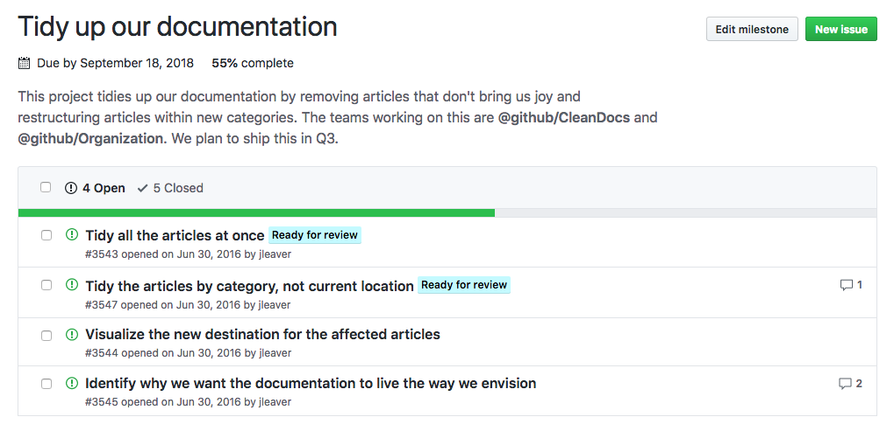

## Issues

Antes de empezar siquiera a trabajar en nuestro proyecto, debemos tener claro en qué vamos a trabajar, en qué consisten esas tareas, y fechas límite para esas tareas. Para ello, tenemos el apartado de Issues en nuestra repo.

Al contrario de lo que pueda suponer la palabra Issue, no es solo para indicar problemas y bugs, sino para también especificar funciones nuevas, cambios a última hora, y también, bugs.

En una Issue tenemos un nombre, un body especificando lo que se conseguirá con la tarea, una etiqueta indicando el tipo de Issue, un responsable que se encargará de esa tarea y la Milestone a la que va a pertenecer esa tarea.

Una vez creadas nuestras Issues, el panel quedará tal que así. 

Además, en nuestro panel principal de Github, veremos las issues que tenemos asignadas a nuestro usuario.

## 

## Milestones

Para controlar que un cambio no simboliza un cambio en producción, al igual que en un sprint, tenemos los Milestones. En un milestone, podemos asignar distintos issues y pull requests, y marcar una fecha límite para ellos.

Las milestones no generan ramas ni releases ni necesitan reviews, para ello están las Pull Request, solo nos sirven para ver el progreso de la fase actual de desarrollo.

## 

## Ramas

Cuando comiences a trabajar en un proyecto, debes comenzar creando una rama nueva en base a development, que servirá como base de tu Issue. Para ello, desde Github, puedes crear una nueva rama directamente desde el selector, teniendo la rama Development seleccionada anteriormente.

Esta rama debe seguir uno de los siguientes esquemas:

*   `Feature`
*   `Bugfix`
*   `Refactor`
*   `Hotfix`

Y estar seguido de una / . P.ej feature/tablas-usuario

## Pull Requests

Una vez que has terminado el desarrollo, y has terminado de trabajar en tu Issue, es hora de abrir una Pull Request.

Para ello, vamos a Github, Pull Request y New Pull Request

Este Pull Request debe hacerse desde nuestra rama de trabajo, a la rama asociada al milestone en el que estamos trabajando.

Aquí asignamos a los reviewers, que se encargarán de aprobar el pull request, a qué Milestone está asociado el pull, las personas asociadas al request y las etiquetas de esta.

El body **debe** especificar a qué Issue estamos haciendo referencia con esta Pull Request. De lo contrario, RepoGuard dará como fallida.

El **body** del Issue debe hacer referencia al Issue en el que hemos trabajado. P.ej Issue #5

Además de las palabras claves de DangerJS, podemos usar las palabras claves de Github para cerrar las Issues automaticamente al hacer el merge correctamente ([https://help.github.com/en/articles/closing-issues-using-keywords](https://help.github.com/en/articles/closing-issues-using-keywords))

Una vez pedida la Pull Request correctamente, CircleCI se encargará de realizar una build de prueba y de hacer los tests. Si son correctos, y tras la aprobación de los reviewers, se procederá a hacer un Merge con la rama

## Resumen

Para resumir, 

1. Crea tus tareas en Github en el apartado Issues
2. Añade las tareas a un milestone
3. Abre una rama específica para cada Issue desde la rama Development
4. Abre un Pull Request cuando termines tu tarea
5. Avisa a los responsables de la repo y reviewers de tu Request
6. **Nunca hagas commit ni merge a master**
